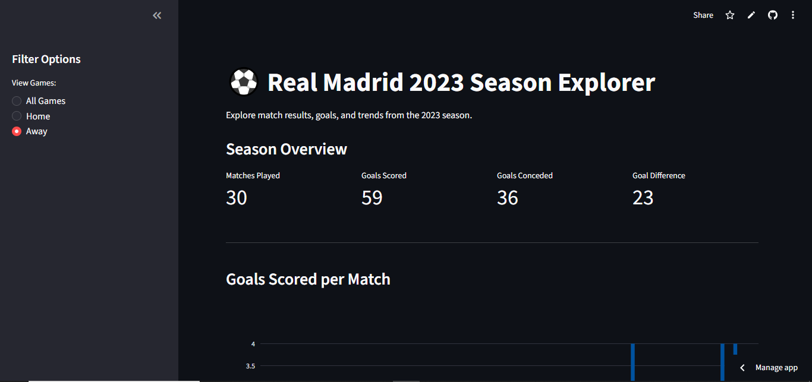

# ⚽ Real Madrid 2023 Season Analytics Dashboard

👉 **[View the Live Interactive Dashboard Here](https://football-api-project-yh5w4mgnv6h5dgxizhwd55.streamlit.app/)**



## 📌 Project Overview
An interactive data science web application built to analyze and visualize Real Madrid's performance during the 2023 season. 

Instead of relying on static CSV files, this project connects directly to the **API-Football** database to fetch live, real-world JSON data. The raw data is then cleaned, processed, and transformed into an interactive, user-friendly dashboard.

## 🚀 Key Features
* **RESTful API Integration:** Automated data extraction using the Python `requests` library to securely pull match fixtures and results.
* **Data Cleaning & Feature Engineering:** Utilized `pandas` to unpack nested JSON dictionaries, handle missing values, and engineer new data points (e.g., isolating Real Madrid's goals from opponent goals).
* **Interactive Visualizations:** Built dynamic bar charts using `plotly.express` that feature hover-data tooltips for granular match details.
* **Dynamic Filtering:** Integrated `streamlit` sidebar controls allowing users to instantly filter the dataset by Home or Away games.
* **KPI Tracking:** Automated calculation of key performance indicators (Total Matches, Goals Scored, Goals Conceded, Goal Difference) displayed prominently at the top of the app.

## 🛠️ Tech Stack
* **Language:** Python
* **Data Manipulation:** Pandas
* **API Communication:** Requests
* **Data Visualization:** Plotly Express
* **Web Framework:** Streamlit
* **Deployment:** Streamlit Community Cloud

## 💻 How to Run Locally
If you want to run this project on your own machine:

1. Clone this repository.
2. Install the required dependencies:
   ```bash
   pip install -r requirements.txt
3. Add your API Key:
   Create a `.streamlit/secrets.toml` file and add your API-Football key:
   ```toml
      API_KEY = "your_api_key_here"
   ```
4. Run the application:
   ```bash
   streamlit run dashboard.py

## 🔑 Prerequisites
To run this project locally, you will need a free API key from API-Football.

1. Go to the [API-Football Dashboard](https://dashboard.api-football.com/register) and create a free account.
2. Navigate to your account dashboard to find your unique API Key.
3. You get 100 free requests per day, which is plenty for this dashboard!
